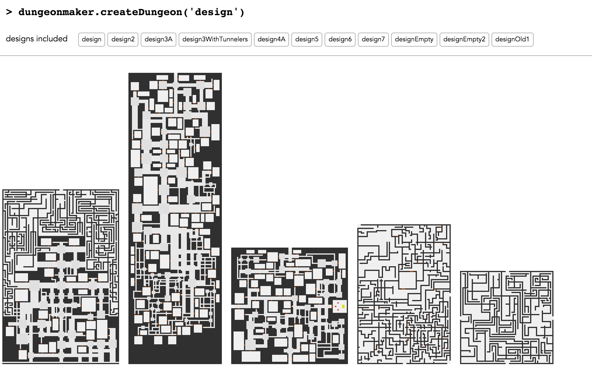

# dungeonmaker.js

*javascript port* (cross compiled with *emscripten* to *asmjs*) of the **dungeonmaker** library!




## how to build

you don't need this - a pre-built version can be found inside `dict/`

### build *dungeonmaker* library with **emscripten**

1. extract the **dungeonmaker** archive

   ```
    $ tar xvf dungeonmaker-2.05.tar.gz
    $ ln -s dungeonmaker-2.05 dungeonmaker
   ```

2. install **emscripten**
3. build the library

   ```
    $ cd dungeonmaker/
    $ emconfigure ./configure
    $ emmake make
  ```

### build *dungeonmaker.js*

inside the root directory ..

```
  $ sh build.sh
```

### http server

you will need an http server to serve the `dist/` directory.


